<p align="center">
  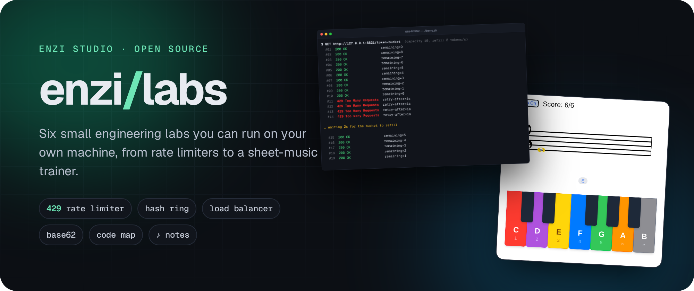
</p>

<p align="center">
  <a href="#the-labs">The labs</a> ·
  <a href="#quick-start">Quick start</a> ·
  <a href="#how-it-works">How it works</a> ·
  <a href="https://enzihub.github.io/enzi-labs/">Gallery site</a> ·
  <a href="#credits">Credits</a>
</p>

<p align="center">
  
  
  
  
  
</p>

Six small projects the Enzi Studio team built to learn by doing. Four of them are hands-on versions of classic system design problems (scaling a web app, rate limiting, a distributed key-value store and a URL shortener), and two are small tools: a Python code mapper and a sheet-music trainer. Each lab sits in its own folder and runs on your own machine.

<p align="center">
  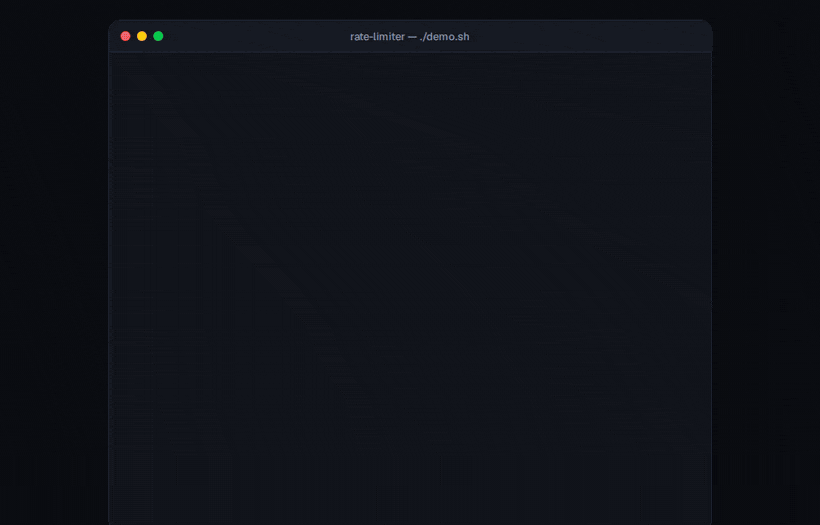
</p>

The system design labs were inspired by the ByteByteGo system design course. This project is not affiliated with or endorsed by ByteByteGo, and it does not contain any course text or diagrams. All code and writing here are our own.

## The labs

<p align="center">
  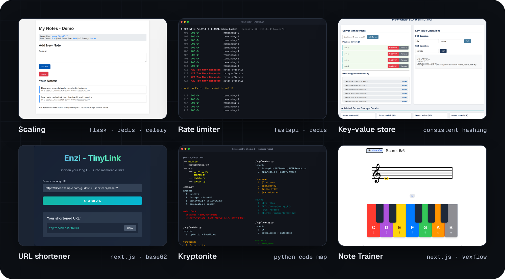
</p>

| Lab | What you can try | Stack | Run |
| --- | --- | --- | --- |
| [**scaling/**](scaling) | A notes app behind a round-robin load balancer, with a Redis cache, sessions in Redis, a primary/replica split, sharding by user id and Celery jobs | Flask · Postgres · Redis · Celery | `docker compose up` |
| [**rate-limiter/**](rate-limiter) | Token bucket, leaking bucket, fixed window and sliding log, as one FastAPI middleware with state in Redis | FastAPI · Redis | `uvicorn app.main:app` |
| [**kv-store/**](kv-store) | A Dynamo-style store with consistent hashing, virtual nodes, N/W/R quorums and nodes you can take down | FastAPI · vanilla JS | `uvicorn main:app` |
| [**url-shortener/**](url-shortener) | Long link in, base62 short code out, with a redirect route and the same code for repeat URLs | Next.js · TypeScript | `npm run dev` |
| [**kryptonite/**](kryptonite) | Point it at a Python project and get a colour-coded map of its tree, imports, env vars, functions, classes and routes | Python | `python kryptonite.py <folder>` |
| [**note-trainer/**](note-trainer) | Learn to read treble and bass clef by pressing the right piano key, then sight-read simple songs | Next.js · VexFlow | `npm run dev` |

### Rate limiter: a burst of requests hits the token bucket

Ten requests drain the bucket and the next four get `429 Too Many Requests` with `Retry-After`. After two seconds the bucket has refilled enough for the next five. This is real output from [`rate-limiter/demo.sh`](rate-limiter/demo.sh).

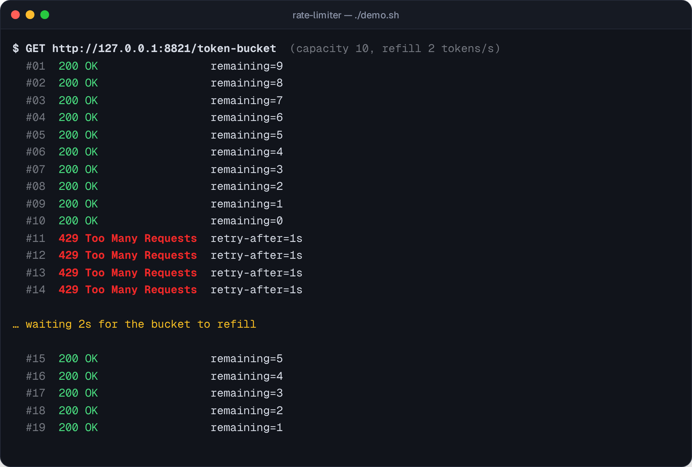

### Key-value store: where each key lives

Four nodes with five virtual nodes each on an MD5 ring. Every key is written to three replicas, and the GET for `user:ada` reached its read quorum of two.

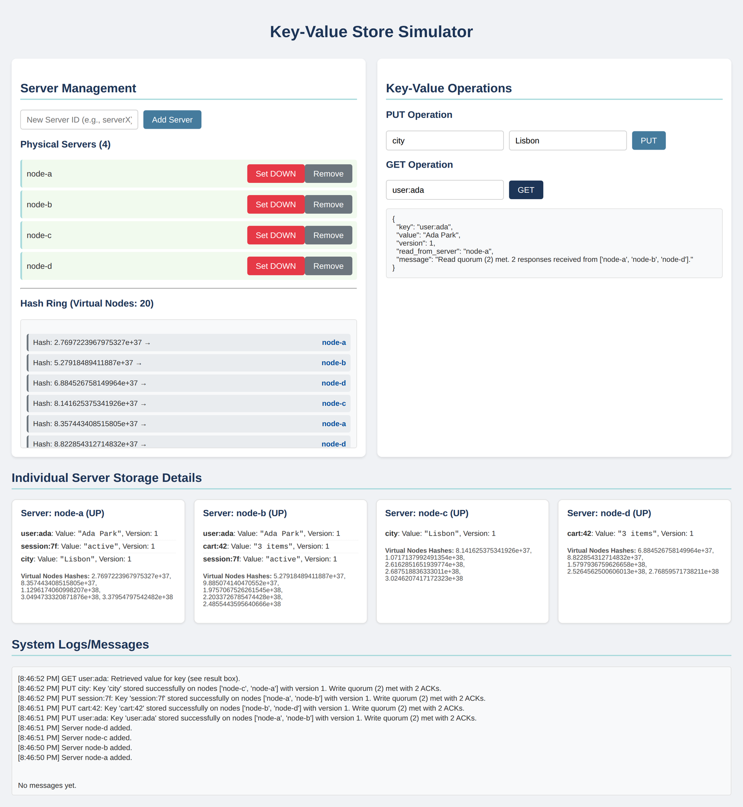

### Scaling: one notes app, three web nodes

Each refresh goes to the next node (5001, 5002, 5003), but your session stays because it lives in Redis. User 7 has an odd id, so their notes go to a shard table. The second read of the same notes comes from the cache.

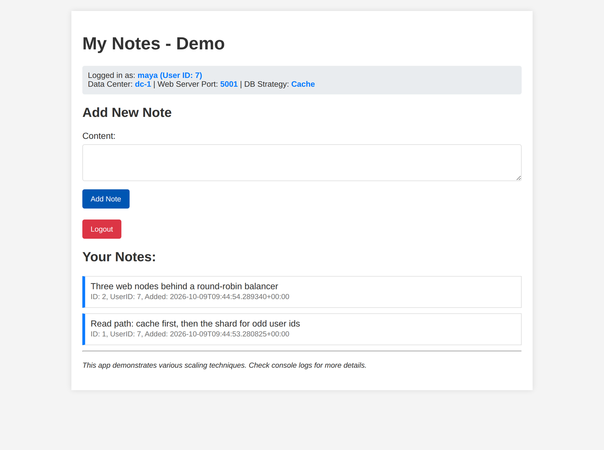

### URL shortener

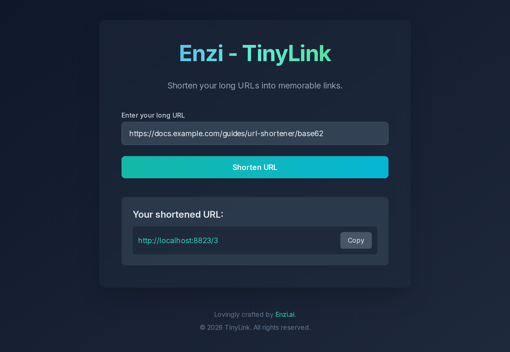

### Kryptonite: a map of a Python project

The repo ships with a tiny invented FastAPI project, `kryptonite/sample/pastry_shop`, to run it on.

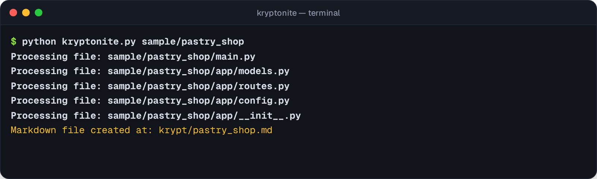
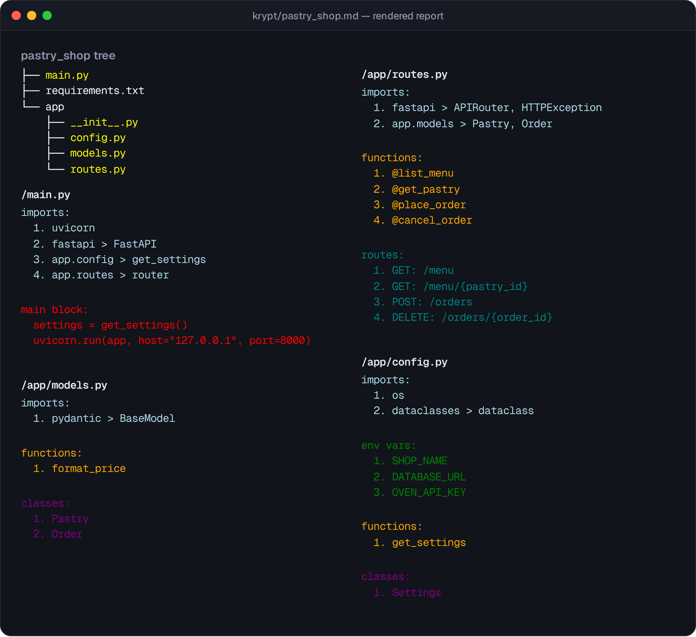

### Note Trainer

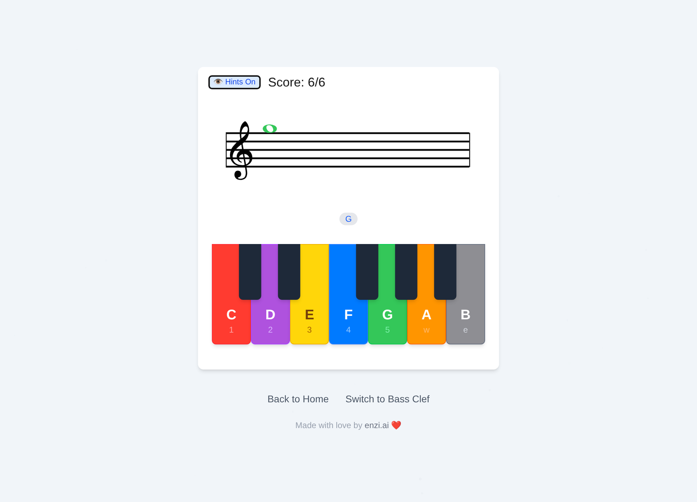

## Quick start

```bash
git clone https://github.com/enzihub/enzi-labs.git
cd enzi-labs
```

Then pick a lab:

```bash
# Scaling: Postgres, Redis, 3 web nodes, a worker and the balancer, all local
cd scaling && docker compose up --build           # http://localhost:8000

# Rate limiter: needs a Redis on localhost:6379
docker run -d -p 6379:6379 redis:7-alpine
cd rate-limiter && pip install -r requirements.txt
uvicorn app.main:app --port 8000 && ./demo.sh     # in a second terminal

# Key-value store
cd kv-store && pip install -r requirements.txt && uvicorn main:app --port 8000

# URL shortener / Note Trainer
cd url-shortener && npm install && npm run dev    # http://localhost:3000
cd note-trainer  && npm install && npm run dev

# Kryptonite
cd kryptonite && pip install -r requirements.txt && python kryptonite.py sample/pastry_shop
```

Every lab's own README has the full steps and the details.

## How it works

<p align="center">
  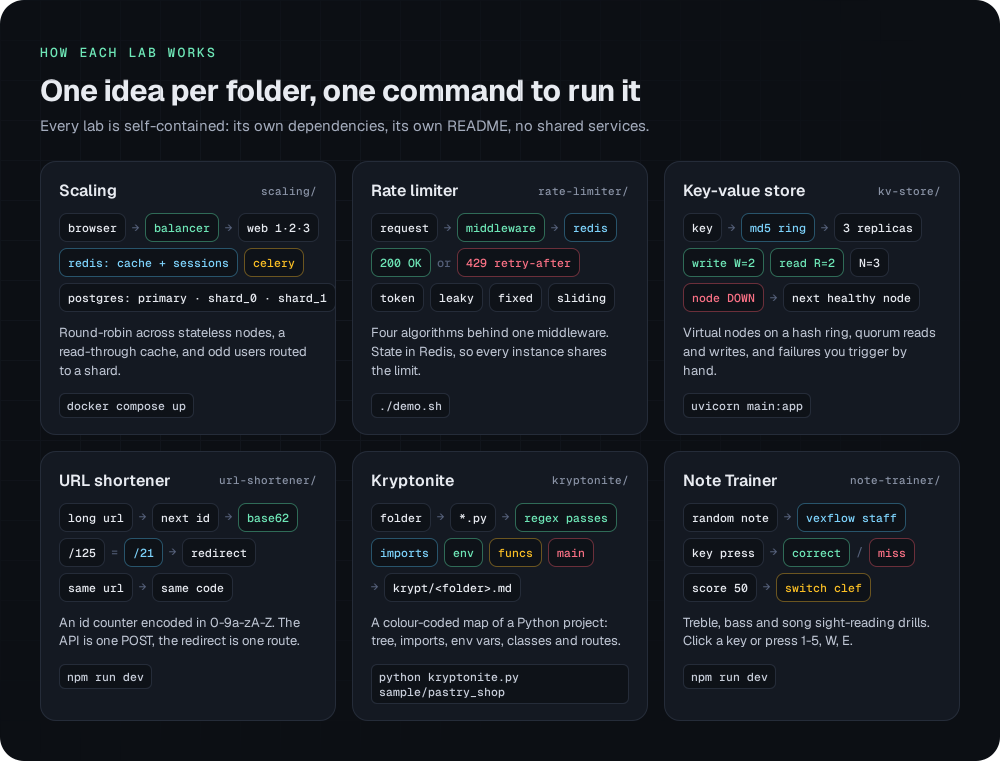
</p>

## Configuration

No lab needs an account or an API key. The few settings there are have local defaults:

| Lab | Variable | Default | Purpose |
| --- | --- | --- | --- |
| scaling | `DATABASE_URL` | empty (uses the bundled Postgres) | Use your own Postgres instead |
| scaling | `POSTGRES_USER` / `POSTGRES_PASSWORD` / `POSTGRES_DB` | `notes` | Bundled local database |
| scaling | `SECRET_KEY` | random at start | Flask secret |
| scaling | `LB_PORT` | `8000` | Load balancer port on the host |
| rate-limiter | `REDIS_HOST` / `REDIS_PORT` / `REDIS_DB` | `localhost` / `6379` / `0` | Where the counters live |
| url-shortener | `NEXT_PUBLIC_BASE_URL` | empty (uses the request origin) | Base for short links |

`scaling/` and `url-shortener/` ship a `.env.example` with empty values. The rate limiter reads plain environment variables.

## Status

Built by Enzi Studio in 2025 as learning projects and shared as-is. These labs are made for reading and experimenting with, not for production. The stores are in memory, the replicas and shards are simulated in one database, and there are no automated tests. Issues and pull requests are welcome, but there is no support schedule.

## Credits

Built by **Enzi Studio**. Code by [@tharindu-s-rajapaksha](https://github.com/tharindu-s-rajapaksha) (scaling, rate limiter, key-value store, URL shortener), [@sun2ii](https://github.com/sun2ii) (Kryptonite) and [@bb-xops](https://github.com/bb-xops) (Note Trainer).

The system design labs were inspired by the ByteByteGo system design course. ByteByteGo is a trademark of its owner. This project is independent and is not affiliated with or endorsed by ByteByteGo. Note Trainer draws notation with [VexFlow](https://www.vexflow.com/). The UI fonts on the gallery site are Geist and Geist Mono by Vercel (SIL Open Font License).

## Licence

[MIT](LICENSE) © 2025-2026 Enzi Studio (Harry Edwards)
